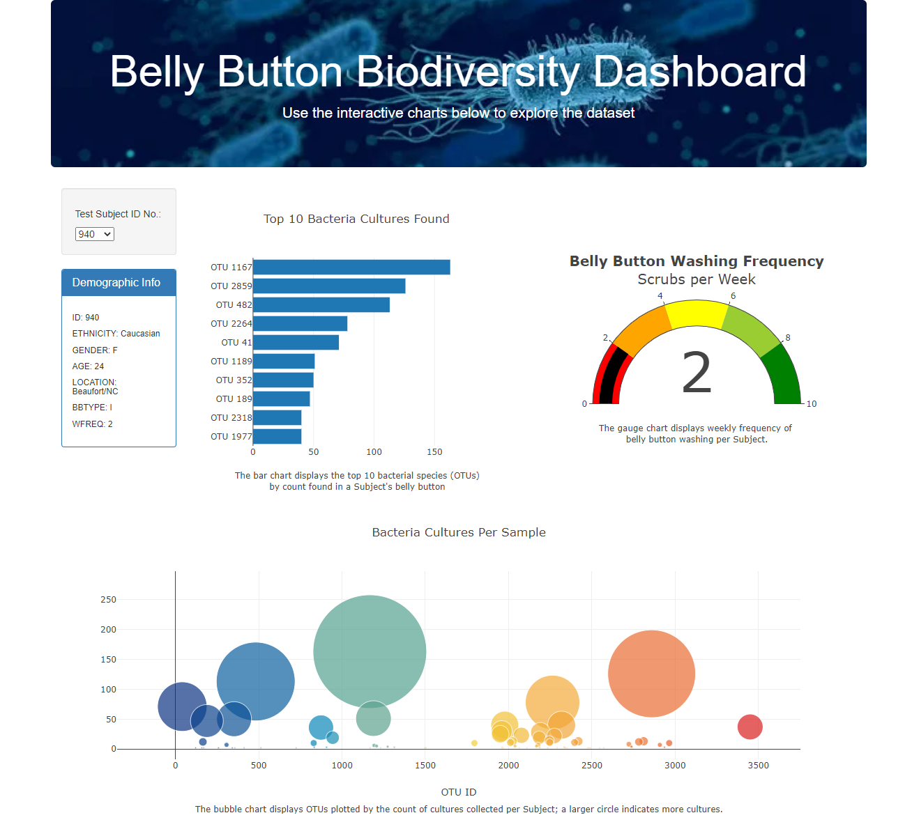
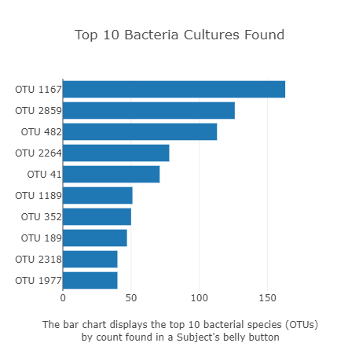
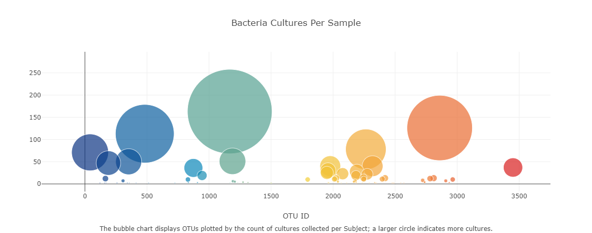
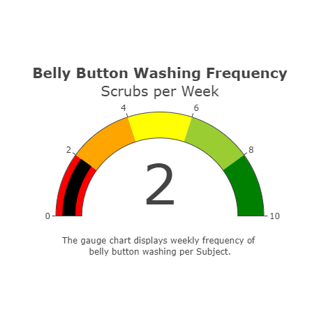

# Belly_Button
## Project Overview
The objective of this challenge was to create a dashboard using plotly and JavaScript to visualize the bacterial species found in the belly buttons of individual study subjects. The resulting dashboard looks as follows: 

## Deliverables
**Deliverable 1 was to create a horizontal bar chart** 

**Deliverable 2 was to create a bubble chart** 

**Deliverable 3 was to create a gauge chart** 

**Deliverable 4 was to create a customize the website** 
As can be seen at the top of the readme, the website has been enhanced with a custom image for the top banner, and text descriptions have been added for each chart. In addition, the webpage has been adapted to be mobile-responsive.

## Website Link
The webpage has been deployed and is accessible at: 
